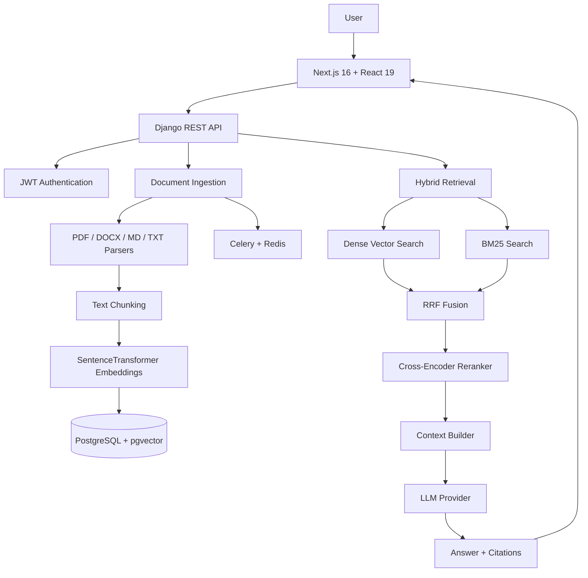

# 🧠 NextMind AI

> **Your knowledge. Your documents. One intelligent workspace.**
>
> A privacy-first AI knowledge workspace for uploading documents, building searchable knowledge bases, and chatting with your data through a production-oriented hybrid RAG pipeline.


## 🚀 What is NextMind AI?

NextMind AI turns your documents into an intelligent, searchable knowledge layer. Instead of relying on an LLM's general knowledge alone, it retrieves relevant information from your own documents and uses that context to generate grounded answers with source citations.

The project combines **semantic search, keyword search, rank fusion, reranking, and LLM generation** into a single end-to-end RAG system.

### ✨ Core capabilities

- 📄 **Document ingestion** — PDF, DOCX, Markdown, and TXT support
- 🧩 **Automatic chunking** — converts documents into retrieval-ready knowledge chunks
- 🔎 **Hybrid retrieval** — combines dense vector search with BM25 keyword search
- 🔀 **Reciprocal Rank Fusion** — merges complementary retrieval results
- 🎯 **Cross-encoder reranking** — improves relevance before context generation
- 🧠 **Local embeddings** — BAAI/bge-base-en-v1.5 with 768-dimensional vectors
- 💬 **Context-aware chat** — supports follow-up questions and query rewriting
- 📚 **Collections** — organize documents into separate knowledge bases
- 🔖 **Source citations** — answers can reference the retrieved source chunks
- 🔌 **Swappable LLM providers** — OpenAI, Anthropic, Gemini, and compatible/local providers
- ⚡ **Async processing** — Celery + Redis handles document processing workloads
- 🔐 **JWT authentication** — secure account and API authentication

## 🏗️ Architecture



## 🔬 RAG Pipeline

When a user asks a question, NextMind AI follows this flow:

1. **Receive the query** through the Django API.
2. **Rewrite the query** when necessary to resolve follow-up questions.
3. **Run dense retrieval** against pgvector using cosine similarity.
4. **Run sparse retrieval** using BM25 for keyword-level matching.
5. **Fuse results** using Reciprocal Rank Fusion (RRF).
6. **Rerank candidates** with `cross-encoder/ms-marco-MiniLM-L-6-v2`.
7. **Build context** from the highest-quality source chunks.
8. **Generate an answer** using the configured LLM provider.
9. **Extract and return citations** alongside the response.
10. **Persist the conversation** and message metadata in PostgreSQL.

## 🧰 Tech Stack

| Layer | Technology |
|---|---|
| Frontend | Next.js 16, React 19, TypeScript 5, Tailwind CSS 4 |
| Backend | Django 4.2, Django REST Framework 3.16 |
| Database | PostgreSQL 16 + pgvector |
| Vector Search | pgvector, cosine similarity, IVFFlat |
| Sparse Search | BM25Okapi (`rank-bm25`) |
| Hybrid Fusion | Reciprocal Rank Fusion (RRF) |
| Reranking | `cross-encoder/ms-marco-MiniLM-L-6-v2` |
| Embeddings | `BAAI/bge-base-en-v1.5` |
| Background Jobs | Celery + Redis |
| LLM Providers | OpenAI, Anthropic, Gemini, Local / compatible APIs |
| Authentication | JWT / SimpleJWT |
| Document Parsing | PyMuPDF, python-docx, Markdown, plain text |

## 📁 Project Structure

```text
NextMind-AI/
├── nextmindai-backend/
│   ├── config/
│   │   ├── settings/
│   │   ├── urls.py
│   │   └── __init__.py
│   ├── apps/
│   │   ├── accounts/          # User model and JWT authentication
│   │   ├── documents/         # Upload, parsing, chunking and embeddings
│   │   ├── knowledge/         # Collections and knowledge management
│   │   ├── retrieval/         # Dense, BM25, fusion and reranking
│   │   ├── conversations/     # Conversation orchestration
│   │   ├── ai/                # LLM providers and context building
│   │   └── core/              # Shared models, pagination and exceptions
│   ├── requirements.txt
│   └── .env.example
│
├── nextmindai-frontend/
│   ├── app/
│   │   ├── login/
│   │   ├── register/
│   │   ├── knowledge/
│   │   ├── collections/
│   │   └── settings/
│   ├── components/
│   │   ├── chat/
│   │   ├── sidebar/
│   │   ├── sources/
│   │   └── ui/
│   ├── lib/
│   │   ├── api.ts
│   │   ├── auth.tsx
│   │   └── types.ts
│   └── package.json
│
└── README.md
```

## ⚡ Getting Started

### Prerequisites

- Python 3.9+
- Node.js 18+
- PostgreSQL 14+ with the `pgvector` extension
- Redis 7+

### Backend

```bash
cd nextmindai-backend

python -m venv venv
source venv/bin/activate

pip install -r requirements.txt
cp .env.example .env

python manage.py migrate
python manage.py createsuperuser
python manage.py runserver 0.0.0.0:8000
```

Run Celery in a separate terminal:

```bash
cd nextmindai-backend
source venv/bin/activate
celery -A config worker -l info
```

### Frontend

```bash
cd nextmindai-frontend
yarn install
yarn dev
```

The frontend runs on `http://localhost:3000` by default.

## 🔐 Environment Configuration

### Backend `.env`

```env
DATABASE_NAME=neondb
DATABASE_USER=neondb_owner
DATABASE_PASSWORD=
DATABASE_HOST=
DATABASE_PORT=5432

REDIS_URL=redis://localhost:6379/0

LLM_PROVIDER=openai
LLM_MODEL=
LLM_BASE_URL=
OPENAI_API_KEY=
ANTHROPIC_API_KEY=
GEMINI_API_KEY=

EMBEDDING_MODEL=BAAI/bge-base-en-v1.5
RERANKER_MODEL=cross-encoder/ms-marco-MiniLM-L-6-v2
MAX_UPLOAD_SIZE=52428800
CORS_ALLOWED_ORIGINS=http://localhost:3000
```

### Frontend `.env.local`

```env
NEXT_PUBLIC_API_URL=http://localhost:8000/api/v1
```

## 🔌 API Overview

| Method | Endpoint | Purpose |
|---|---|---|
| POST | `/api/v1/auth/register/` | Create an account |
| POST | `/api/v1/auth/login/` | Authenticate and receive JWT tokens |
| POST | `/api/v1/auth/token/refresh/` | Refresh access token |
| GET | `/api/v1/auth/me/` | Get current user |
| GET | `/api/v1/documents/` | List documents |
| POST | `/api/v1/documents/` | Upload a document |
| GET | `/api/v1/documents/:id/` | Get document details |
| DELETE | `/api/v1/documents/:id/` | Delete a document |
| GET | `/api/v1/collections/` | List collections |
| POST | `/api/v1/collections/` | Create a collection |
| GET | `/api/v1/collections/:id/` | Get collection details |
| PATCH | `/api/v1/collections/:id/` | Update a collection |
| DELETE | `/api/v1/collections/:id/` | Delete a collection |
| GET | `/api/v1/conversations/` | List conversations |
| GET | `/api/v1/conversations/:id/` | Get conversation history |
| PATCH | `/api/v1/conversations/:id/` | Rename a conversation |
| DELETE | `/api/v1/conversations/:id/` | Delete a conversation |
| POST | `/api/v1/chat/` | Ask a question using RAG |

## 🛡️ Design Principles

**Privacy-first** — Your knowledge base is treated as application data rather than generic public knowledge.

**Grounded generation** — Retrieval happens before generation so the LLM receives relevant document context.

**Provider-agnostic AI** — The LLM layer is designed around interchangeable providers rather than locking the application to one model vendor.

**Production-minded retrieval** — Dense retrieval alone is not enough; NextMind AI combines semantic and lexical retrieval with fusion and reranking.

**Modular architecture** — Authentication, ingestion, knowledge management, retrieval, conversations, and AI services are separated into focused Django applications.

## 🗺️ Roadmap

- [ ] Streaming chat responses
- [ ] Improved multilingual retrieval
- [ ] More document formats
- [ ] Advanced document metadata and filtering
- [ ] Retrieval evaluation and benchmarking
- [ ] Workspace/team collaboration
- [ ] Role-based access control
- [ ] Observability and RAG analytics
- [ ] Production deployment templates

## 🤝 Contributing

Contributions, ideas, bug reports, and technical discussions are welcome. Open an issue or submit a pull request with a clear description of the proposed change.

## 📄 License

License information will be added as the project is prepared for public release.

---

<p align="center">
  <strong>NextMind AI</strong><br />
  <sub>Turn your documents into an intelligent knowledge workspace.</sub>
</p>
