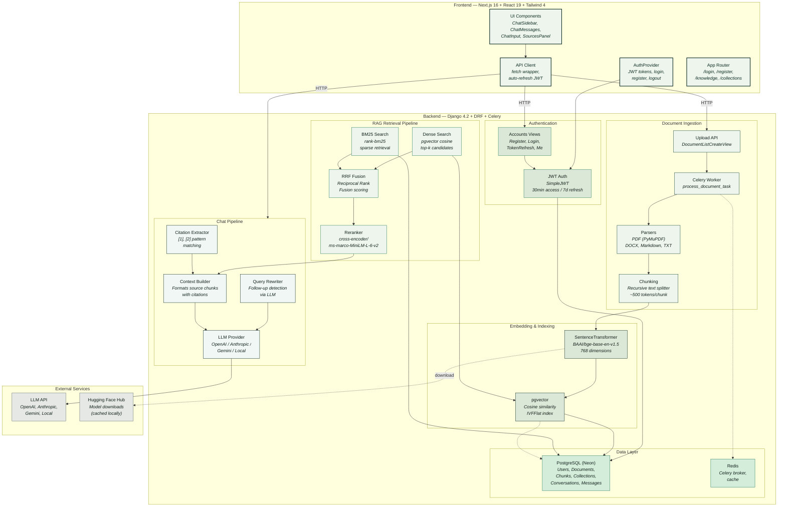
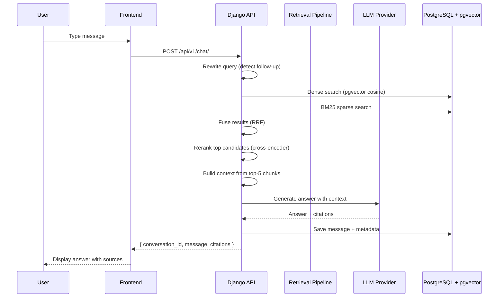
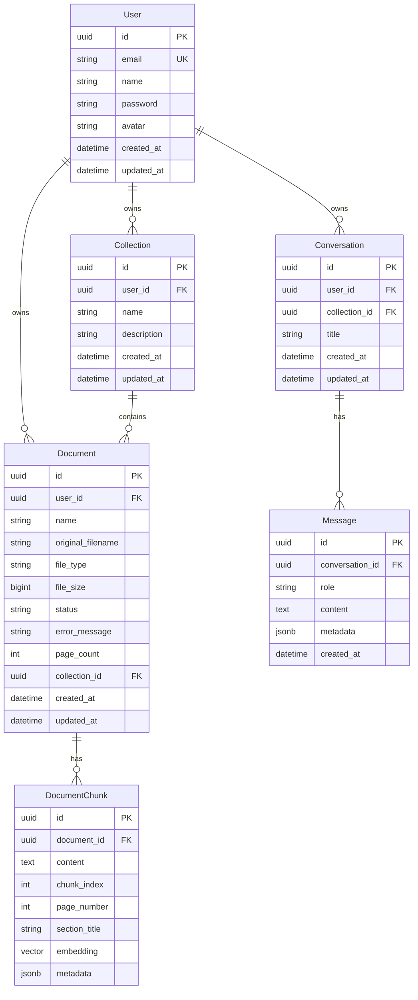

# NextMind AI

> A privacy-first, AI-powered knowledge workspace. Upload documents, build knowledge bases, and chat with your data using a full RAG pipeline.


---

## Architecture



---

## Tech Stack

| Layer | Technology |
|---|---|
| **Frontend** | Next.js 16, React 19, Tailwind CSS 4, TypeScript 5 |
| **Backend** | Django 4.2, Django REST Framework 3.16 |
| **Database** | PostgreSQL (Neon) + pgvector extension |
| **Vector Search** | pgvector (cosine similarity), IVFFlat indexing |
| **Sparse Search** | BM25Okapi (rank-bm25) |
| **Hybrid Fusion** | Reciprocal Rank Fusion (RRF) |
| **Reranking** | cross-encoder/ms-marco-MiniLM-L-6-v2 |
| **Embeddings** | BAAI/bge-base-en-v1.5 (768-dim) |
| **Task Queue** | Celery + Redis |
| **LLM Providers** | OpenAI, Anthropic, Gemini, Local (swappable) |
| **Auth** | JWT (SimpleJWT) — 30min access, 7-day refresh |
| **Document Parsing** | PyMuPDF (PDF), python-docx, Markdown, plain text |

---

## Project Structure

```
NextMind-AI/
├── nextmindai-backend/
│   ├── config/
│   │   ├── settings/          # base.py, development.py
│   │   ├── urls.py            # API v1 routing
│   │   └── __init__.py        # Celery app
│   ├── apps/
│   │   ├── accounts/          # User model, JWT auth
│   │   ├── documents/         # Upload, parse, chunk, embed
│   │   ├── knowledge/         # Collections, embedding service
│   │   ├── retrieval/         # Dense, BM25, fusion, reranker
│   │   ├── conversations/     # Chat orchestration
│   │   ├── ai/                # LLM providers, context builder
│   │   └── core/              # Models, pagination, exceptions
│   ├── requirements.txt
│   ├── .env                   # Secrets (not committed)
│   └── .env.example
├── nextmindai-frontend/
│   ├── app/
│   │   ├── page.tsx           # Chat (main)
│   │   ├── login/             # Login page
│   │   ├── register/          # Register page
│   │   ├── knowledge/         # Document manager
│   │   ├── collections/       # Knowledge collections
│   │   └── settings/          # Settings page
│   ├── components/
│   │   ├── App.tsx            # Chat orchestrator
│   │   ├── ClientLayout.tsx   # Auth gate + Toast
│   │   ├── chat/              # ChatSidebar, ChatMessages, etc.
│   │   ├── sidebar/           # Knowledge sidebar
│   │   ├── sources/           # Source citation panel
│   │   └── ui/                # Icons, Markdown, Toast
│   ├── lib/
│   │   ├── api.ts             # Fetch wrapper + JWT refresh
│   │   ├── auth.tsx           # AuthProvider + useAuth
│   │   └── types.ts           # TypeScript interfaces
│   └── package.json
└── README.md
```

---

## How the RAG Pipeline Works



---

## Getting Started

### Prerequisites

- Python 3.9+
- Node.js 18+
- PostgreSQL 14+ with pgvector extension
- Redis 7+

### Backend Setup

```bash
cd nextmindai-backend

# Create virtual environment
python -m venv venv
source venv/bin/activate

# Install dependencies
pip install -r requirements.txt

# Configure environment
cp .env.example .env
# Edit .env with your database, Redis, and LLM API keys

# Run migrations
python manage.py migrate

# Create superuser
python manage.py createsuperuser

# Start Django
python manage.py runserver 0.0.0.0:8000

# Start Celery worker (separate terminal)
celery -A config worker -l info
```

### Frontend Setup

```bash
cd nextmindai-frontend

# Install dependencies
yarn install

# Start development server
yarn dev
```

Open [http://localhost:3000](http://localhost:3000).

---

## Environment Variables

### Backend (`.env`)

| Variable | Description | Example |
|---|---|---|
| `DATABASE_NAME` | PostgreSQL database name | `neondb` |
| `DATABASE_USER` | PostgreSQL username | `neondb_owner` |
| `DATABASE_PASSWORD` | PostgreSQL password | — |
| `DATABASE_HOST` | PostgreSQL host | `ep-xxx.neon.tech` |
| `DATABASE_PORT` | PostgreSQL port | `5432` |
| `REDIS_URL` | Redis connection URL | `redis://localhost:6379/0` |
| `LLM_PROVIDER` | LLM backend | `openai` |
| `LLM_MODEL` | Model identifier | `gemini-2.5-flash` |
| `LLM_BASE_URL` | LLM API base URL | — |
| `OPENAI_API_KEY` | OpenAI / compatible API key | — |
| `ANTHROPIC_API_KEY` | Anthropic API key | — |
| `GEMINI_API_KEY` | Google Gemini API key | — |
| `EMBEDDING_MODEL` | Sentence-transformer model | `BAAI/bge-base-en-v1.5` |
| `RERANKER_MODEL` | Cross-encoder model | `cross-encoder/ms-marco-MiniLM-L-6-v2` |
| `MAX_UPLOAD_SIZE` | Max file upload (bytes) | `52428800` (50MB) |
| `CORS_ALLOWED_ORIGINS` | Allowed CORS origins | `http://localhost:3000` |

### Frontend (`.env.local`)

| Variable | Description | Example |
|---|---|---|
| `NEXT_PUBLIC_API_URL` | Backend API base URL | `http://localhost:8000/api/v1` |

---

## API Endpoints

| Method | Endpoint | Description |
|---|---|---|
| `POST` | `/api/v1/auth/register/` | Register new account |
| `POST` | `/api/v1/auth/login/` | Login, returns JWT |
| `POST` | `/api/v1/auth/token/refresh/` | Refresh access token |
| `GET` | `/api/v1/auth/me/` | Get current user profile |
| `GET` | `/api/v1/documents/` | List documents |
| `POST` | `/api/v1/documents/` | Upload document |
| `GET` | `/api/v1/documents/:id/` | Get document detail |
| `DELETE` | `/api/v1/documents/:id/` | Delete document |
| `GET` | `/api/v1/collections/` | List collections |
| `POST` | `/api/v1/collections/` | Create collection |
| `GET` | `/api/v1/collections/:id/` | Get collection with documents |
| `PATCH` | `/api/v1/collections/:id/` | Update collection |
| `DELETE` | `/api/v1/collections/:id/` | Delete collection |
| `GET` | `/api/v1/conversations/` | List conversations |
| `GET` | `/api/v1/conversations/:id/` | Get conversation with messages |
| `PATCH` | `/api/v1/conversations/:id/` | Rename conversation |
| `DELETE` | `/api/v1/conversations/:id/` | Delete conversation |
| `POST` | `/api/v1/chat/` | Send chat message (RAG) |

---

## Database Schema



---

## Key Design Decisions

| Decision | Rationale |
|---|---|
| **pgvector over Pinecone/Weaviate** | Zero external dependencies, runs on Neon free tier |
| **Hybrid search (Dense + BM25 + RRF)** | Dense captures semantic meaning, BM25 catches exact keywords, RRF combines both without tuning |
| **Cross-encoder reranking** | Re-ranks top-30 candidates to top-5 for higher precision |
| **Celery for document processing** | Non-blocking ingestion — upload returns immediately, embedding runs async |
| **JWT with 30min expiry** | Stateless auth with auto-refresh for seamless UX |
| **Multi-provider LLM** | Swap between OpenAI, Anthropic, Gemini, or local models via env variable |
| **LimitOffset pagination** | Consistent `{success, data, pagination}` response format |

---

## License

Private — NextMind AI
