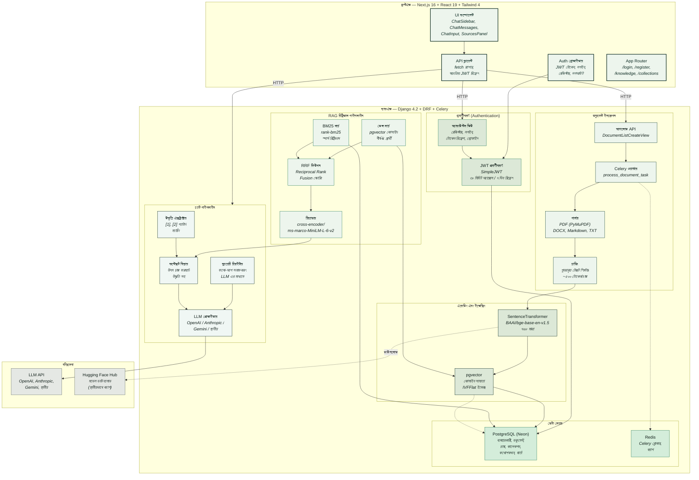
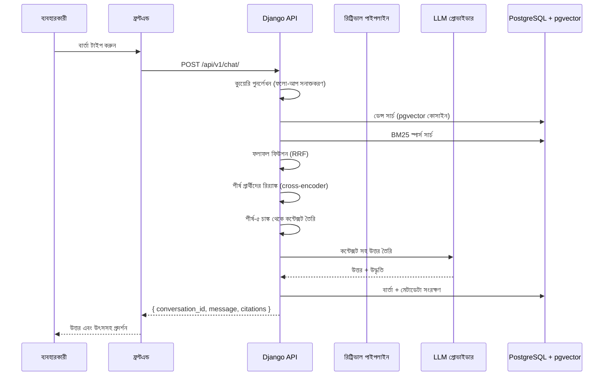
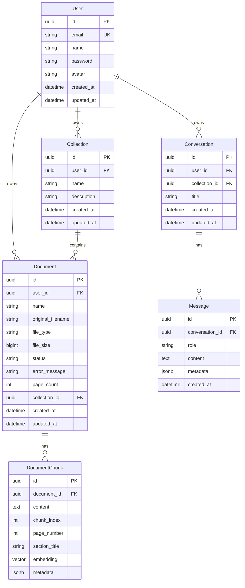

# NextMind AI

> একটি প্রাইভেসি-ফার্স্ট, AI-চালিত জ্ঞান কর্মক্ষেত্র। ডকুমেন্ট আপলোড করুন, জ্ঞান বেস তৈরি করুন, এবং আপনার ডেটার সাথে RAG পাইপলাইন ব্যবহার করে চ্যাট করুন।


---

## স্থাপত্য (Architecture)



---

## প্রযুক্তি স্ট্যাক

| স্তর | প্রযুক্তি |
|---|---|
| **ফ্রন্টএন্ড** | Next.js 16, React 19, Tailwind CSS 4, TypeScript 5 |
| **ব্যাকএন্ড** | Django 4.2, Django REST Framework 3.16 |
| **ডেটাবেস** | PostgreSQL (Neon) + pgvector এক্সটেনশন |
| **ভেক্টর সার্চ** | pgvector (কোসাইন সাম্যতা), IVFFlat ইন্ডেক্সিং |
| **স্পার্স সার্চ** | BM25Okapi (rank-bm25) |
| **হাইব্রিড ফিউশন** | Reciprocal Rank Fusion (RRF) |
| **রির‍্যাঙ্কিং** | cross-encoder/ms-marco-MiniLM-L-6-v2 |
| **এম্বেডিং** | BAAI/bge-base-en-v1.5 (৭৬৮-মাত্রা) |
| **টাস্ক কিউ** | Celery + Redis |
| **LLM প্রোভাইডার** | OpenAI, Anthropic, Gemini, স্থানীয় (পরিবর্তনযোগ্য) |
| **প্রমাণীকরণ** | JWT (SimpleJWT) — ৩০ মিনিট অ্যাক্সেস, ৭ দিন রিফ্রেশ |
| **ডকুমেন্ট পার্সিং** | PyMuPDF (PDF), python-docx, Markdown, প্লেইন টেক্সট |

---

## প্রজেক্ট গঠন

```
NextMind-AI/
├── nextmindai-backend/
│   ├── config/
│   │   ├── settings/          # base.py, development.py
│   │   ├── urls.py            # API v1 রাউটিং
│   │   └── __init__.py        # Celery অ্যাপ
│   ├── apps/
│   │   ├── accounts/          # ব্যবহারকারী মডেল, JWT প্রমাণীকরণ
│   │   ├── documents/         # আপলোড, পার্সিং, চাঙ্কিং, এম্বেডিং
│   │   ├── knowledge/         # কালেকশন, এম্বেডিং সেবা
│   │   ├── retrieval/         # ডেন্স, BM25, ফিউশন, রির‍্যাঙ্কার
│   │   ├── conversations/     # চ্যাট অর্কেস্ট্রেশন
│   │   ├── ai/                # LLM প্রোভাইডার, কন্টেক্সট বিল্ডার
│   │   └── core/              # মডেল, পেজিনেশন, এক্সেপশন
│   ├── requirements.txt
│   ├── .env                   # সিক্রেট (কমিট হয় না)
│   └── .env.example
├── nextmindai-frontend/
│   ├── app/
│   │   ├── page.tsx           # চ্যাট (মূল)
│   │   ├── login/             # লগইন পৃষ্ঠা
│   │   ├── register/          # রেজিস্টার পৃষ্ঠা
│   │   ├── knowledge/         # ডকুমেন্ট ম্যানেজার
│   │   ├── collections/       # জ্ঞান কালেকশন
│   │   └── settings/          # সেটিংস পৃষ্ঠা
│   ├── components/
│   │   ├── App.tsx            # চ্যাট অর্কেস্ট্রেটর
│   │   ├── ClientLayout.tsx   # Auth গেট + Toast
│   │   ├── chat/              # ChatSidebar, ChatMessages ইত্যাদি
│   │   ├── sidebar/           # জ্ঞান সাইডবার
│   │   ├── sources/           # উৎস উদ্ধৃতি প্যানেল
│   │   └── ui/                # আইকন, Markdown, Toast
│   ├── lib/
│   │   ├── api.ts             # fetch র‍্যাপার + JWT রিফ্রেশ
│   │   ├── auth.tsx           # AuthProvider + useAuth
│   │   └── types.ts           # TypeScript ইন্টারফেস
│   └── package.json
└── README.md
```

---

## RAG পাইপলাইন কীভাবে কাজ করে



---

## শুরু করুন

### পূর্বশর্ত

- Python 3.9+
- Node.js 18+
- PostgreSQL 14+ pgvector এক্সটেনশন সহ
- Redis 7+

### ব্যাকএন্ড সেটআপ

```bash
cd nextmindai-backend

# ভার্চুয়াল এনভায়রনমেন্ট তৈরি
python -m venv venv
source venv/bin/activate

# নির্ভরতা ইনস্টল
pip install -r requirements.txt

# এনভায়রনমেন্ট কনফিগার
cp .env.example .env
# আপনার ডেটাবেস, Redis, এবং LLM API কী দিয়ে .env সম্পাদনা করুন

# মাইগ্রেশন চালান
python manage.py migrate

# সুপারইউজার তৈরি
python manage.py createsuperuser

# Django চালু করুন
python manage.py runserver 0.0.0.0:8000

# Celery ওয়ার্কার (আলাদা টার্মিনাল)
celery -A config worker -l info
```

### ফ্রন্টএন্ড সেটআপ

```bash
cd nextmindai-frontend

# নির্ভরতা ইনস্টল
yarn install

# ডেভেলপমেন্ট সার্ভার চালু
yarn dev
```

[http://localhost:3000](http://localhost:3000) খুলুন।

---

## এনভায়রনমেন্ট ভ্যারিয়েবল

### ব্যাকএন্ড (`.env`)

| ভ্যারিয়েবল | বিবরণ | উদাহরণ |
|---|---|---|
| `DATABASE_NAME` | PostgreSQL ডেটাবেসের নাম | `neondb` |
| `DATABASE_USER` | PostgreSQL ব্যবহারকারীর নাম | `neondb_owner` |
| `DATABASE_PASSWORD` | PostgreSQL পাসওয়ার্ড | — |
| `DATABASE_HOST` | PostgreSQL হোস্ট | `ep-xxx.neon.tech` |
| `DATABASE_PORT` | PostgreSQL পোর্ট | `5432` |
| `REDIS_URL` | Redis সংযোগ URL | `redis://localhost:6379/0` |
| `LLM_PROVIDER` | LLM ব্যাকএন্ড | `openai` |
| `LLM_MODEL` | মডেল আইডেন্টিফায়ার | `gemini-2.5-flash` |
| `LLM_BASE_URL` | LLM API বেস URL | — |
| `OPENAI_API_KEY` | OpenAI / সামঞ্জস্যপূর্ণ API কী | — |
| `ANTHROPIC_API_KEY` | Anthropic API কী | — |
| `GEMINI_API_KEY` | Google Gemini API কী | — |
| `EMBEDDING_MODEL` | Sentence-transformer মডেল | `BAAI/bge-base-en-v1.5` |
| `RERANKER_MODEL` | Cross-encoder মডেল | `cross-encoder/ms-marco-MiniLM-L-6-v2` |
| `MAX_UPLOAD_SIZE` | সর্বোচ্চ ফাইল আপলোড (বাইট) | `52428800` (50MB) |
| `CORS_ALLOWED_ORIGINS` | অনুমোদিত CORS উৎস | `http://localhost:3000` |

### ফ্রন্টএন্ড (`.env.local`)

| ভ্যারিয়েবল | বিবরণ | উদাহরণ |
|---|---|---|
| `NEXT_PUBLIC_API_URL` | ব্যাকএন্ড API বেস URL | `http://localhost:8000/api/v1` |

---

## API এন্ডপয়েন্ট

| মেথড | এন্ডপয়েন্ট | বিবরণ |
|---|---|---|
| `POST` | `/api/v1/auth/register/` | নতুন অ্যাকাউন্ট রেজিস্টার |
| `POST` | `/api/v1/auth/login/` | লগইন, JWT প্রদান করে |
| `POST` | `/api/v1/auth/token/refresh/` | অ্যাক্সেস টোকেন রিফ্রেশ |
| `GET` | `/api/v1/auth/me/` | বর্তমান ব্যবহারকারীর প্রোফাইল |
| `GET` | `/api/v1/documents/` | ডকুমেন্ট তালিকা |
| `POST` | `/api/v1/documents/` | ডকুমেন্ট আপলোড |
| `GET` | `/api/v1/documents/:id/` | ডকুমেন্টের বিস্তারিত |
| `DELETE` | `/api/v1/documents/:id/` | ডকুমেন্ট মুছুন |
| `GET` | `/api/v1/collections/` | কালেকশন তালিকা |
| `POST` | `/api/v1/collections/` | কালেকশন তৈরি |
| `GET` | `/api/v1/collections/:id/` | ডকুমেন্টসহ কালেকশন |
| `PATCH` | `/api/v1/collections/:id/` | কালেকশন আপডেট |
| `DELETE` | `/api/v1/collections/:id/` | কালেকশন মুছুন |
| `GET` | `/api/v1/conversations/` | কথোপকথন তালিকা |
| `GET` | `/api/v1/conversations/:id/` | বার্তাসহ কথোপকথন |
| `PATCH` | `/api/v1/conversations/:id/` | কথোপকথন পুনরাম দিন |
| `DELETE` | `/api/v1/conversations/:id/` | কথোপকথন মুছুন |
| `POST` | `/api/v1/chat/` | চ্যাট বার্তা পাঠান (RAG) |

---

## ডেটাবেস স্কিমা



---

## মূল স্থাপত্যিক সিদ্ধান্ত

| সিদ্ধান্ত | যুক্তি |
|---|---|
| **pgvector, Pinecone/Weaviate এর পরিবর্তে** | কোনো বহিঃসেবা নির্ভরতা নেই, Neon ফ্রি টিয়ারে চলে |
| **হাইব্রিড সার্চ (ডেন্স + BM25 + RRF)** | ডেন্স অর্থগত অর্থ ধরে, BM25 সঠিক কীওয়ার্ড ধরে, RRF উভয়কে টিউনিং ছাড়া একত্রিত করে |
| **Cross-encoder রির‍্যাঙ্কিং** | শীর্ষ-৩০ প্রার্থীকে শীর্ষ-৫ পর্যন্ত রির‍্যাঙ্ক করে উচ্চতর নির্ভুলতা নিশ্চিত করে |
| **ডকুমেন্ট প্রক্রিয়াকরণের জন্য Celery** | অ-ব্লকিং ইনজেশন — আপলোড তাৎক্ষণিকভাবে ফিরে আসে, এম্বেডিং অ্যাঙ্কর চলে |
| **৩০ মিনিট মেয়াদের JWT** | নির্বিঘ্ন UX এর জন্য স্বয়ংক্রিয় রিফ্রেশ সহ স্টেটলেস প্রমাণীকরণ |
| **মাল্টি-প্রোভাইডার LLM** | এনভায়রনমেন্ট ভ্যারিয়েবলের মাধ্যমে OpenAI, Anthropic, Gemini, বা স্থানীয় মডেল পরিবর্তন |
| **LimitOffset পেজিনেশন** | ধারাবাহিক `{success, data, pagination}` প্রতিক্রিয়া ফরম্যাট |

---

## লাইসেন্স

ব্যক্তিগত — NextMind AI
